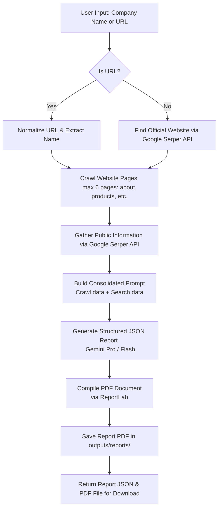

# AI Company Research Assistant 

An intelligent, automated company research pipeline that gathers information, crawls web pages, extracts public data, generates an AI intelligence report, and compiles it into a downloadable PDF document.

---

## System Architecture & Pipeline Flow

The research pipeline processes either a raw company name or a website URL and extracts structured insights. Below is the workflow diagram:



---

##  Key Features

- **Smart URL/Name Resolution:** Automatically detects if input is a URL or a name. If it's a name, it uses Google Search to resolve the most relevant official domain.
- **Deep Web Crawling:** Crawls up to 6 core pages of the resolved website (including About Us, Products, Services, Solutions, and Contact) to build context.
- **Multi-Vector Public Search:** Conducts search queries via the Serper API across multiple axes (overview, products, contact details, business challenges, competitors).
- **Gemini AI Report Synthesis:** Utilizes the Google Gemini model to process gathered text and search snippets, mapping them into a structured intelligence schema.
- **Automatic PDF Compilation:** Generates styled PDF reports on-the-fly with clean tabular layouts.
- **Windows Compatible:** Configured for cross-platform compatibility out of the box.

---

## Tech Stack

- **Backend:** FastAPI (Python 3.13)
- **AI Core:** Google Gemini API (supporting `gemini-2.5-flash` or `gemini-2.5-pro`)
- **Search Integrations:** Google Serper API
- **Web Crawling:** BeautifulSoup4, Requests
- **PDF Generation:** ReportLab
- **Frontend:** Vanilla HTML5, CSS3, & JS (modern UI/UX design)

---

## 📦 Project Structure

```text
├── config.py             # Settings, environment variable loaders, and constants
├── main.py               # FastAPI server, endpoints, and server setup
├── schemas.py            # Pydantic data schemas for request/response models
├── requirements.txt      # Python dependencies (optimized with Windows markers)
├── services/             # Core pipeline service modules
│   ├── crawler_service.py # Website crawler & HTML parsing
│   ├── gemini_service.py  # Prompt generation & Gemini API integration
│   ├── openrouter_service.py # Optional alternative LLM service
│   ├── pdf_service.py     # PDF document structure and styling generator
│   ├── serper_service.py  # Google Serper API queries
│   └── utils.py          # URL normalization and naming helpers
├── static/               # Frontend stylesheets and JS files
├── templates/            # HTML views (Jinja2 templates)
└── outputs/              # Directory containing compiled PDF reports
```

---

## 🚀 Getting Started

### 1. Prerequisites
Ensure you have **Python 3.10+** (or Conda/Miniconda) installed on your system.

### 2. Clone and Setup Environment
Navigate to the project root directory and create/activate your virtual environment:

```powershell
# Create environment
conda create -n relu python=3.13 -y
conda activate relu

# Install dependencies
pip install -r requirements.txt
```
> [!NOTE]
> **Windows Compatibility:** The `uvloop` dependency is configured with environment markers (`sys_platform != 'win32'`) to automatically bypass compilation on Windows and use Python's built-in `asyncio` event loop.

### 3. Configure API Keys
Create a `.env` file at the root of the project:

```ini
SERPER_API_KEY=your_google_serper_api_key
GEMINI_API_KEY=your_google_gemini_api_key
GEMINI_MODEL=gemini-2.5-flash
APP_NAME=AI Company Research Assistant
```

### 4. Run the Pipeline Server
Start the development server:

```powershell
python main.py
```

The application will start and be available at **`http://localhost:8000`**.

---

## 🛰️ API Documentation

### 1. Run Research
- **Endpoint:** `POST /api/research`
- **Request Body:**
  ```json
  {
    "company_input": "Figma",
    "applicant_name": "Jane Doe",
    "applicant_email": "jane@example.com",
    "serper_api_key": null,
    "gemini_api_key": null,
    "gemini_model": "gemini-2.5-flash"
  }
  ```
- **Response:**
  ```json
  {
    "status": "success",
    "report": {
      "company_name": "Figma",
      "website": "https://figma.com",
      "phone_number": "Not available",
      "address": "Not available",
      "products_services": [...],
      "company_summary": "...",
      "ai_generated_pain_points": [...],
      "competitors": [...]
    },
    "pdf_file": "figma_research_report.pdf"
  }
  ```

### 2. Download Report PDF
- **Endpoint:** `GET /api/download-pdf/{file_name}`
- **Response:** Returns the compiled PDF file from the server's output cache.
